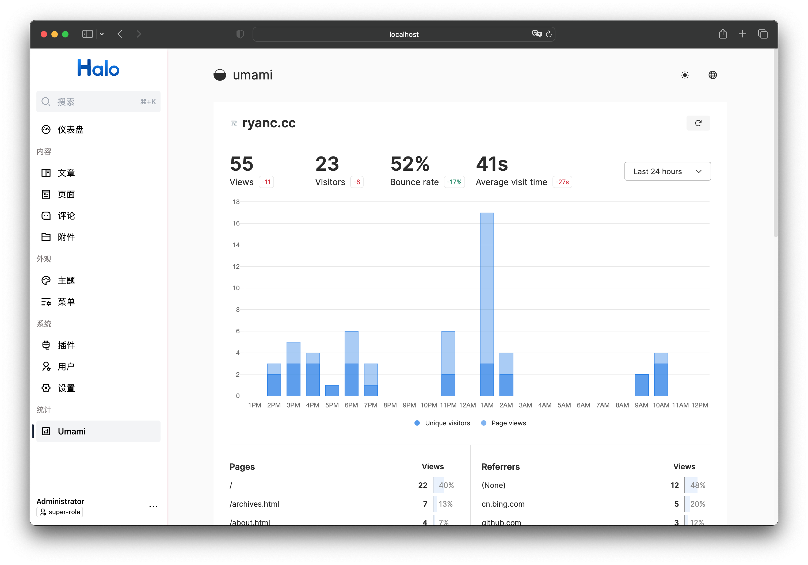

# plugin-umami

Halo 2.0 对 [Umami](https://github.com/umami-software/umami) 的集成。(WIP)

## 特性

- 支持注入 Umami 的统计代码到每个页面的 head 标签内。
- 支持设置分享链接以供在 Halo 控制台查看统计数据。

## 后续计划

- [ ] 通过调用 Umami 的接口，实现一些 Dashboard 的 Widget。

## 安装与使用

1. 在 [Releases](https://github.com/ruibaby/plugin-umami/releases) 下载最新的 JAR 文件。
2. 在 Halo 后台的插件管理上传 JAR 文件进行安装。
3. 启动该插件之后，需要在设置配置 Umami 的相关信息。
